# dio_challenges_power_bi_mysql
Project made during DIO's "Python Data Analytics" Bootcamp, under the section "Processando e Transformando Dados com Power BI". This project shows basic interactions between Azure MySQL and Microsoft Power BI

---

## Step-by-step:

### 1. Creating a MySQL instance

1.1. Open Azure Portal \
1.2. Select "SQL Databases"

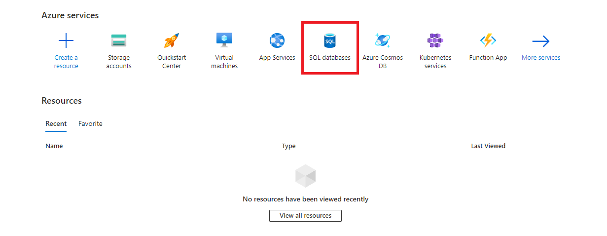

1.3. Search for "mysql"

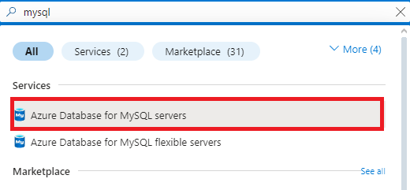

1.4. Click on "Create"

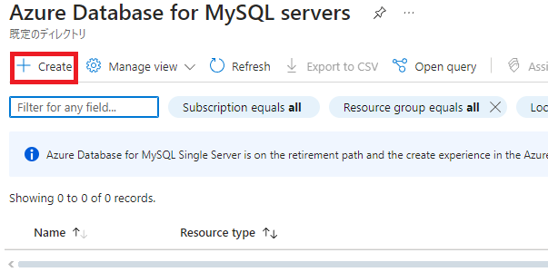

1.5. Select Flexible server and click on "Create"

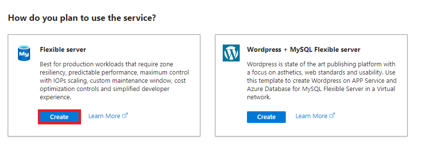

1.6. Configure server then click on "Next: Networking"

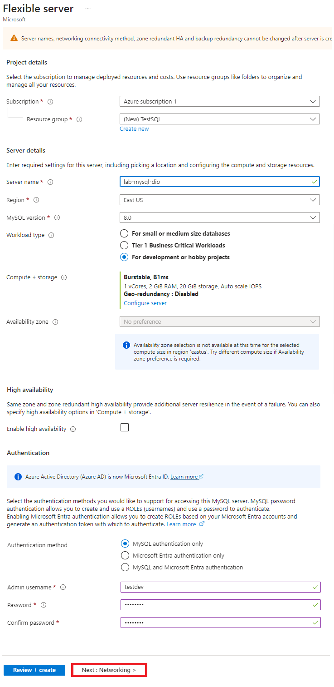

1.7. Enable "Allow public access from any Azure service within Azure to this server" then click on "Next: Security"

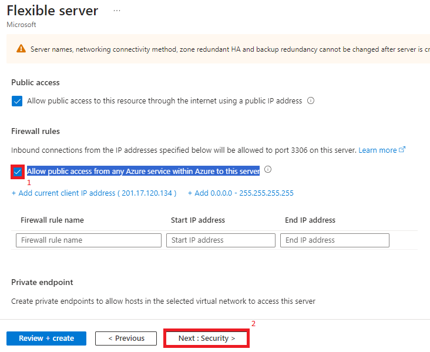

1.8. Leave default settings then click on "Next: Tags" \
1.9. Leave default settings then click on "Next: Review + create" \
1.10. Click on "Create", then wait for validation and deployment

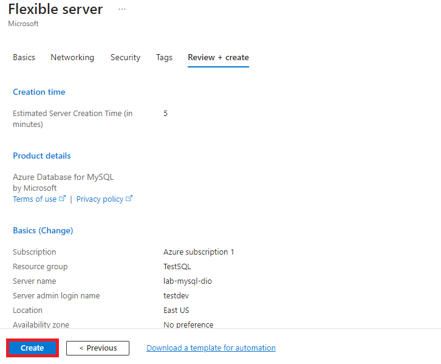

1.11. After deploying resource, click to access it

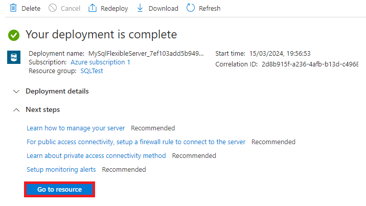

### 2. Connect to database using Cloud Shell

2.1. In resource's main page, click on Cloud Shell icon

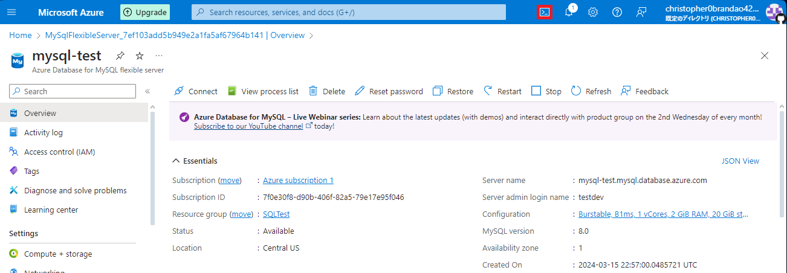

2.2. In the first run screen, select "Bash"

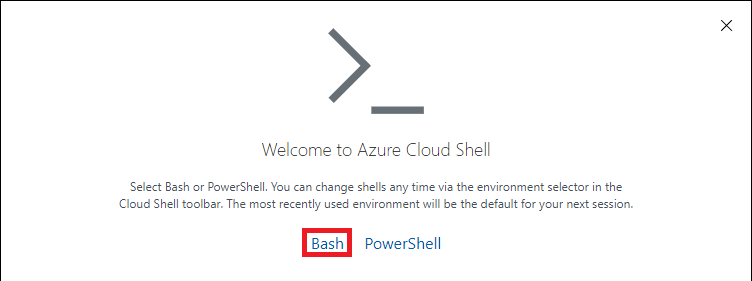

2.3. Select your subscript and click "Create storage"

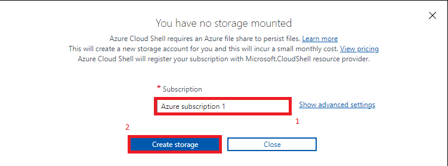

This is the opened interface

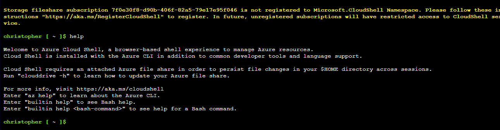

2.4. Access mysql CLI

2.5. Create database and tables and populate them. The used commands are found at SQL folder. \
	**Note:** Created tables were filled with data before getting new constraints. In other words, CREATE TABLE queries were run before ALTER TABLE queries

Creating schema/database:

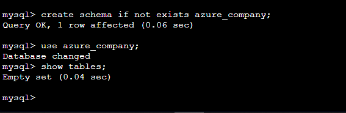

Creating table:

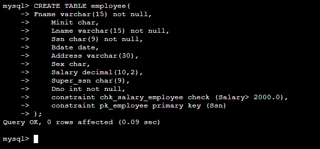

Adding and altering info in table:

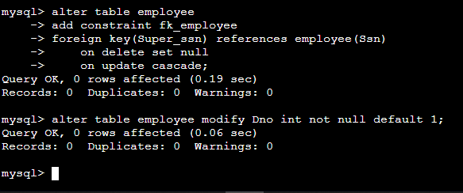

### 3. Insert rules to allow access to a given IP

3.1. In resource's main page, go to Settings->Networking

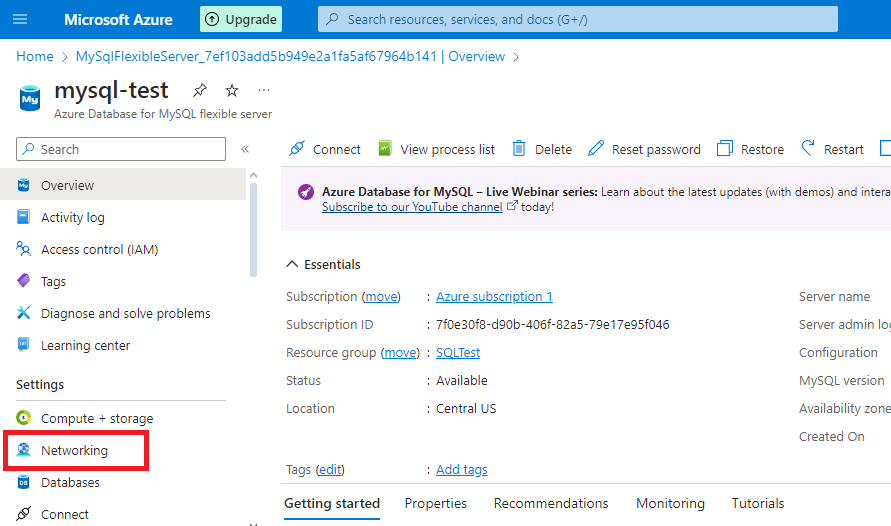

3.2. Select the "Allow public access..." box if not already selected, then click on "+ Add 0.0.0.0 - 255.255.255.255". Then, click on "Save". \
	(**Note it is not recommended doing it unless when using a VPN or for testing purposes**)

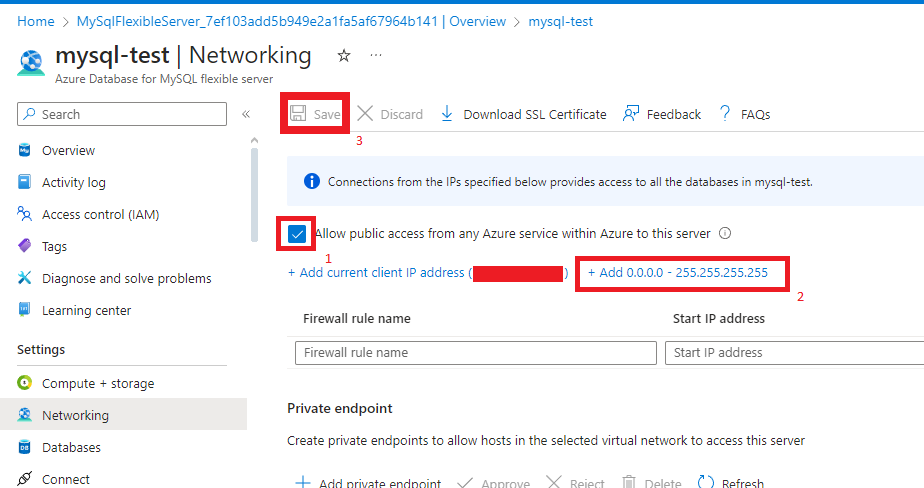

### 4. Using MySQL Workbench to connect to database

4.1. In resource's main page, go to Settings->Connect

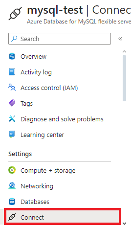

4.2. Go to MySQL Workbench section and follow its instructions \
4.3. In order to get SSL Certification, go back to resource's main page, then go to Settings->Networking, and click on "Download SSL Certificate"

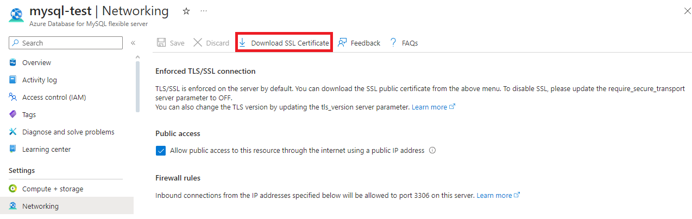

4.4. In MySQL Workbench, select created connection. It should be already there. If not, then the connection must be recreated

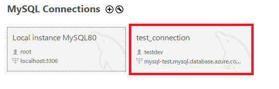

### 5. Connecting MySQL to Power BI

5.1. On Power BI Desktop, click on "Get Data", then select "MySQL Database"

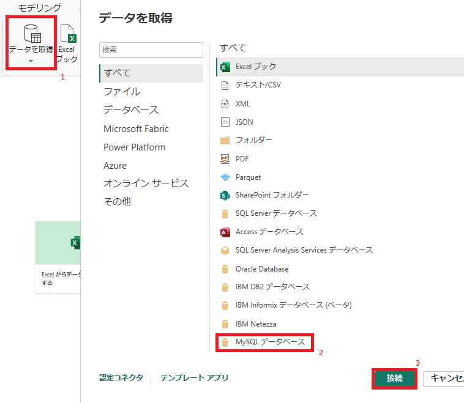

5.2. Fill in the server name and the database, then click "OK"

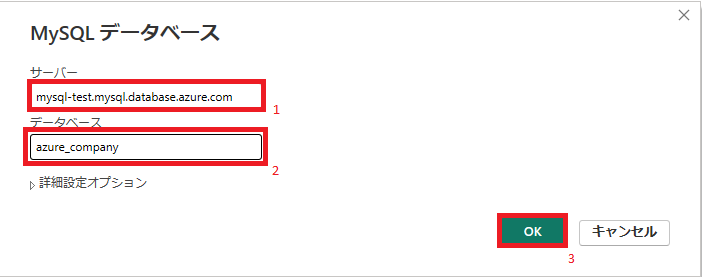

5.3. If it's the first access, it will be necessary to insert the credentials. Use the database ones to access

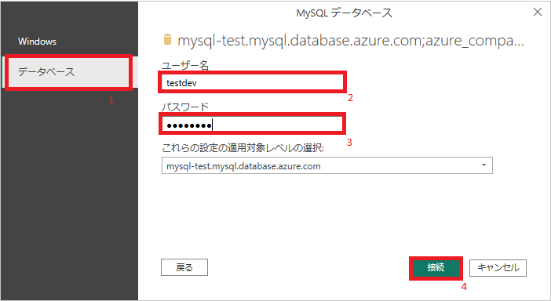

5.4. Once database is connected to Power BI, it is possible to transform the data and use its info to create charts, tables, and other elements

